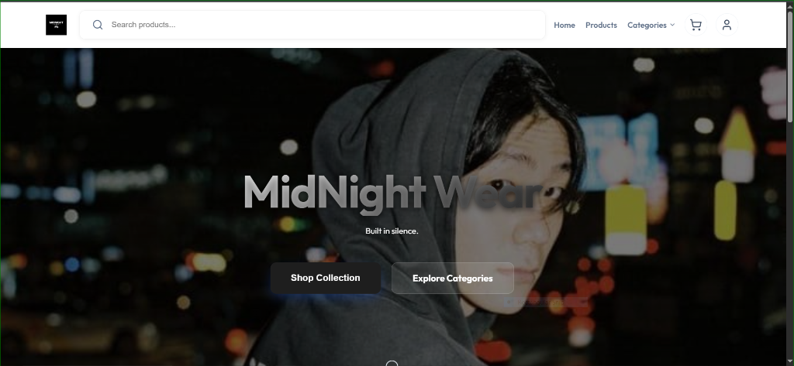
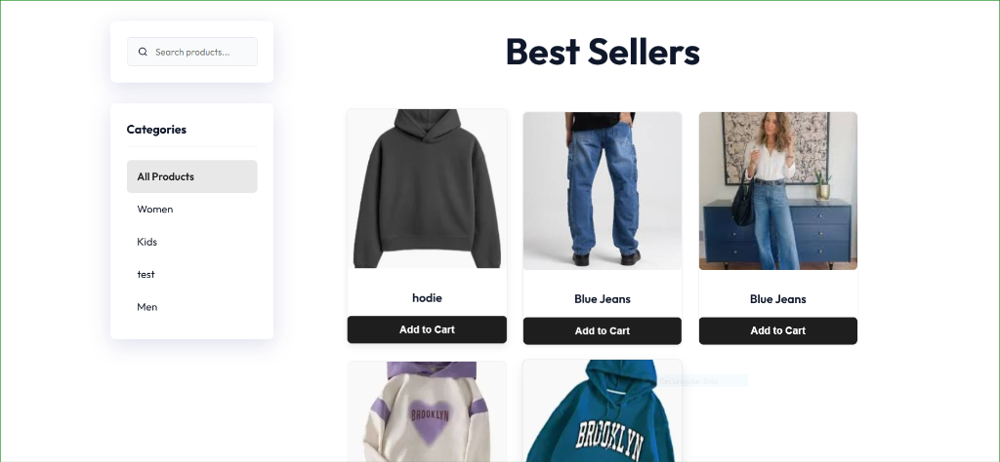
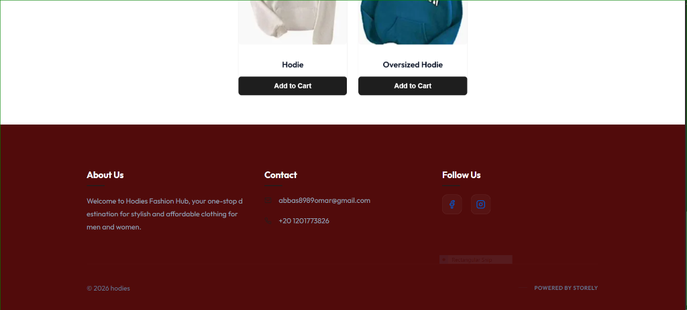
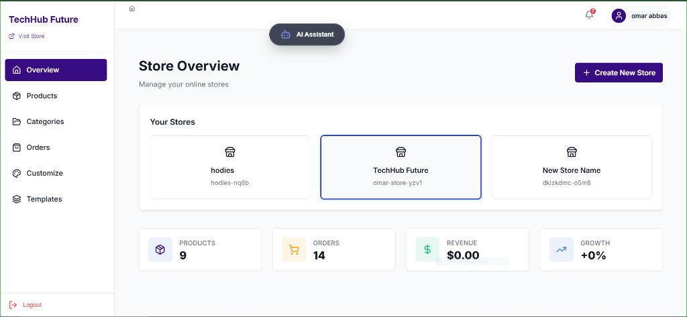
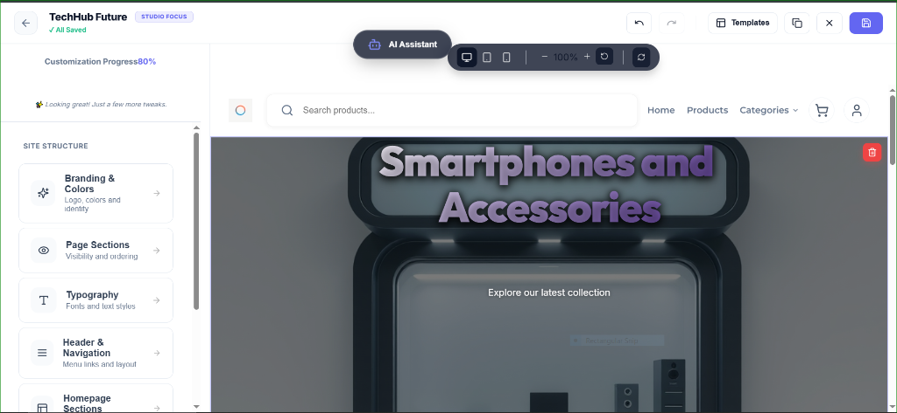

# 🛒 Storely - The Ultimate Multi-Tenant E-commerce Builder

Storely is a high-performance, AI-driven e-commerce platform designed for multi-tenancy. It allows users to create, customize, and manage beautiful online stores in seconds. From AI-powered onboarding to a real-time visual customizer, Storely provides a premium experience for both store owners and customers.

---

## 🖼️ Visual Experience

### Premium Storefront

*A sleek, modern storefront with glassmorphism effects and responsive design.*

<p align="center">
  
  
</p>
<p align="center">
  <em>Product grid with sidebar navigation and a professional, content-rich footer.</em>
</p>

### Powerful Admin & Customizer
<p align="center">
  
</p>
<p align="center">
  <em>Comprehensive store overview dashboard with real-time analytics.</em>
</p>

<p align="center">
  
  
</p>
<p align="center">
  <em>Real-time Store Customizer: Edit branding, typography, and page sections on the fly.</em>
</p>

---

## ✨ Key Features

### 🤖 AI-Driven Creation
- **Intelligent Onboarding**: Build your entire store structure through a conversational AI assistant.
- **Auto-Content Generation**: AI generates SEO-friendly descriptions, categories, and initial products.

### 🎨 Visual Studio (Customizer)
- **Live Preview**: See changes instantly as you edit colors, fonts, and layouts.
- **Section Management**: Add, remove, and reorder homepage sections with ease.
- **Theme Engine**: Switch between premium templates or build your own unique brand identity.

### 🛍️ Premium Shopping Experience
- **Skeleton Loading**: Zero-layout-shift loading states using premium skeleton screens across all pages.
- **Optimized Galleries**: Advanced image fitting and lazy loading for a lightning-fast catalog.
- **Persistent Cart**: Seamless shopping experience across sessions.
- **Smart Search**: Real-time filtering and sorting for large product inventories.

### 🏗️ Enterprise Infrastructure
- **Multi-Tenancy**: Securely host thousands of stores on a single platform with slug-based routing.
- **Robust API**: RESTful backend built with Node.js, Express, and Prisma ORM.
- **Asset Library**: Integrated media management with optimized image delivery.

---

## �️ Technology Stack

### **Frontend**
- **Core**: React 18 with Vite
- **State**: Zustand (Lightweight & Fast)
- **Styling**: Vanilla CSS (Custom Design System with CSS Variables)
- **Icons**: Lucide React
- **Animations**: CSS Transitions & Bezier Curves

### **Backend**
- **Server**: Node.js & Express
- **Database**: PostgreSQL with **Prisma ORM**
- **AI**: Groq SDK Integration
- **Storage**: Cloudinary for high-speed media delivery
- **Security**: JWT Authentication, Role-Based Access Control (RBAC)

---

## 🚀 Quick Start

### 1. Backend Setup
```bash
cd Backend
npm install
# Configure your .env (see .env.example)
npx prisma migrate dev
npm run dev
```

### 2. Frontend Setup
```bash
cd Frontend
npm install
# Set VITE_API_URL in .env
npm run dev
```

---

## 🤝 Contributing & Support

We welcome contributions to Storely! Feel free to open issues or submit pull requests to help us build the future of e-commerce.

**Built with ❤️ by Omar Abbas**
