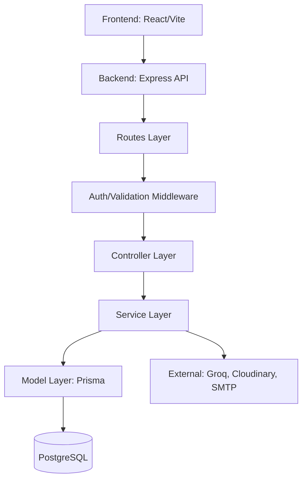

# Storely Technical Analysis Report

This document provides a deep-dive technical analysis of the Storely project, covering its architecture, routing, security, and AI capabilities.

---

## 🏗️ Project Overview & Architecture

### High-Level Architecture
Storely follows a **Monolithic Tiered Architecture** with a clear separation of concerns, utilizing a **Dependency Injection (DI)** pattern via a central container.



### Technology Stack
- **Frameworks:** Node.js (Express), React (Vite).
- **ORM:** Prisma (Postgres).
- **Architecture Pattern:** Controller-Service-Model with DTOs and DI.
- **Key Libraries:**
    - **Backend:** `express`, `prisma`, `jsonwebtoken`, `groq-sdk`, `multer`, `winston`.
    - **Frontend:** `zustand`, `react-router-dom`, `@dnd-kit`, `react-hook-form`.

---

## 🛤️ Routing & Store Access Analysis

### API Endpoint Categorization

| Category | Typical Endpoints | Logic |
| :--- | :--- | :--- |
| **Authentication** | `/api/auth/*` | Handle JWT generation, email verification, and password resets. |
| **Store Management** | `/api/stores` | CRUD operations for stores. Restricted to logged-in owners. |
| **Public Storefront**| `/api/stores/slug/:slug` | Publicly accessible for storefront rendering. |
| **AI Onboarding** | `/api/onboarding/*` | AI-assisted store setup and chat. |
| **Products/Categories**| `/api/products`, `/api/categories` | Catalog management. |

### Store Access Logic & Multi-Tenancy
The system implements **Logical Multi-Tenancy** using an `owner_id` on the `Store` model.

**1. Authentication Flow:**
- `auth.js` middleware extracts the JWT from `Authorization: Bearer <token>`.
- `verifyToken` decodes the user ID and role, attaching them to `req.user`.

**2. Access Control (Stores Per User):**
- **Retrieval:** When a user hits `GET /api/stores`, the `StoreController` calls `storeService.getAllStores(req.query)`. 
- **Filtering:** Most management routes use `req.user.id` to ensure data isolation.
- **Ownership Validation:** For sensitive operations (Update/Delete), the `StoreService` performs a strict check:
  ```javascript
  const store = await this.storeModel.findById(storeId);
  if (store.owner_id !== ownerId) throw new AppError('Unauthorized', 403);
  ```

---

## 🤖 AI Controller & Service Analysis

### AI Controller (`OnboardingController`)
- **Endpoints:**
    - `POST /api/onboarding/ai-chat`: Stateless chat session for gathering store requirements.
    - `POST /api/onboarding/ai-create`: Finalizes store creation based on AI-extracted answers.
- **Security:** Requires authentication to finalize store creation, preventing bot-spam stores.

### AI Service (`AIService`)
The AI integration is designed with a robust **Failover Strategy**:
1. **OpenAI (Primary):** `gpt-4o-mini`.
2. **OpenRouter (Fallback):** `gemini-2.0-flash`.
3. **Groq (Secondary Fallback):** `llama-3.3-70b`.

**Prompt Engineering Strategies:**
- **Minimal Schema:** To optimize tokens, the system generates a `minimalSchema` (abbreviated keys like `f`, `t`, `r`) before sending to the LLM.
- **Strict Output Control:** The system prompt forces JSON-only responses and specific keys (`message`, `extractedAnswers`, `isComplete`).
- **Fuzzy Normalization:** `normalizeExtractedAnswers` in `ai.service.js` handles inconsistencies in LLM output (e.g., converting "modernMinimal" to "modern-minimal").

---

## 🛡️ Security Analysis

1. **Store Data Isolation:** Robust ownership checks in the service layer prevent ID-guessing attacks (Insecure Direct Object Reference).
2. **AI Protection:** 
    - AI endpoints are structured to only accept sanitized messages and specific schema-bound answers.
    - Failover mechanisms ensure availability even if one provider's API is down.
3. **Input Validation:** Use of Joi/Zod schemas in the `validate` middleware ensures only well-formed data reaches the services.
4. **Database Security:** Prisma's parameterized queries automatically prevent SQL injection.

---

## 🚀 Performance & Improvements

### Performance Considerations
- **AI Latency:** LLM responses can take 1-3 seconds. The split between `ai-chat` and `ai-create` keeps the UX responsive.
- **Database Caching:** Currently, every store/product fetch hits the DB. Implementing Redis for public storefront data would significantly improve throughput.

### Recommendations
1. **Subdomain Routing:** Implement a middleware that detects subdomains (e.g., `mystore.storely.com`) and automatically sets context for the public storefront API.
2. **AI Context Compression:** For long onboarding chats, implement message summarizing to stay within token limits.
3. **Rate Limiting:** Explicitly implement `express-rate-limit` on the AI and Auth endpoints to prevent cost spikes and brute-force attacks.
4. **Audit Logs:** Add an activity log table to track significant changes in store settings for security auditing.
